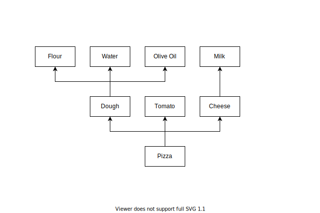
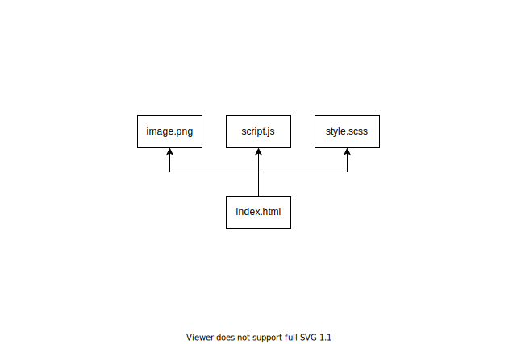
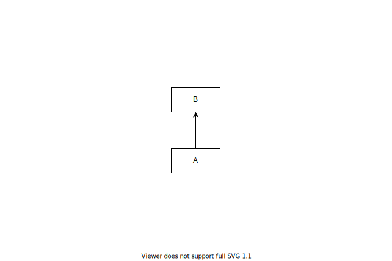
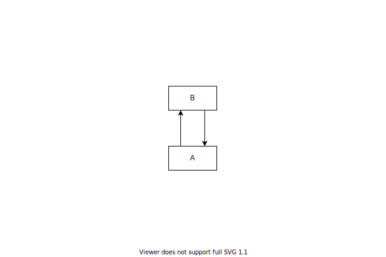

<!--
  title: Why dependencies matter?
  tags: [software engineering, software architecture]
-->

# Why dependencies matter?

`Dependency` is one of the more intuitive concept in software engineering, and also one of the more useful.

Understanding dependencies between the diffent parts of a system will help you to make desicion based on something more realiable than intuition, dogma or elegance.


## What is a dependency?

> A dependency is a unidirectional relationship between two logical entity. A entity depend of another, when incomplete without it.

Abstact definition are the worst. Let's try to be more real: PIZZA 🍕.


A pizza depends on his ingredients, like `Tomato`, `Cheese`, `Dough`, and, `Pineapple`? Also `Cheese` requires `Milk` to be made, and if you are not aware of it, `Milk` are produced by `Cow`. `Cow` have a lot of needs and produce a lot more thing other than `Milk`.

Let's keep the scope managable, because `Cheese` & `Olive Oil` are really complex and delicous products.



Pizza are great, but let's see something less eatable.

Web's foundation rest on `HTML` document, they depend on `images`, `styles` and `scripts` to be complete. When a style is missing everyting is off, without scripts custom behavoirs are broken or worst nothing is shown to the user, and imagine reddit without image.



`HTML` don't have a uniform way to declare dependencies, scripts are usually imported using `<script src="script.js"></script>`, images can be include in the page via ``, and styles are apply by `<link href="style.css" rel="stylesheet" />`. Links can also been see as dependencies, because a broken link will lead to undesirable state, but scoping can be a good idea, by the way links a actually called anchors `<a />`.

I hear you. You are not writing simple HTML pages but complexe application in TypeScript. Dependency is a versatile concept, and can be apply to different aspect of the code. Let's start with **dependency between symbols**.

```typescript
const bar = () => {
  // world changing code...
}

const foo = () => {
  // complex but super clear code...
  bar()
  // amazing code...
}
```

Without `bar`, `foo` can not run. So `foo` depends on `bar`. Pretty simple right? Maybe too easy, let's make it more fun.

```typescript
// ./bar.ts
const bar = () => {
  // puppies saving code...
}

export default bar
```

```typescript
// ./foo.ts

import bar from './bar.ts'

const foo = () => {
  // expert code...
  bar()
  // great code...
}
```

As the previous example, `foo` depends on `bar`, but this time the functions are in different files. `./foo.ts` import `bar` from `./bar.ts`, and doing that will create a **dependency between modules**, `foo` depends on `bar`.

Dependencies between symbols and modules are declarative, easy to spot and understand. But imperative dependencies are often hiden and easy to miss, because they are linked to the context.

```typescript
class MyClass {
  open() {
    // opening code...
  }

  close() {
    // closing code...
  }
}

const a = new MyClass()
// important code...
a.open()
// bad code, but obvisly writien by someone else...
a.close()
// disrupting code...
```

Calling `close` before `open` will fail. Here we have **dependency between statements**, `close` should be called after `open` to run. The dependency is very **implicit**, the only clue is the namming, open/close convention certainly helps, and the failure will happen at run-time.

We can make the dependency more **explicit** by moving things around.

```typescript
class MyClass {
  open(): MyClassOpened {
    // opening code...
  }
}

class MyClassOpened {
  close() {
    // closing code...
  }
}

const a = new MyClass()
// rocket science code...
const opened = a.open()
// kitten saving code...
opened.close()
// nerdy code...
```

Now, calling `close` without calling `open` is more difficult. It requires a little bit more of code and add complexity in some cases, but it will fail at compile-time and will be clearer for others. Don't forget: you don't write code for yourself, you are writing code for your futur self, contributors and a machine.

### Why dependency is a unidirectional relationship?

`A` **depends** on `B`. We represent the dependency by an solid arrow from `A` to `B`.



The arrow make the relationship clear, and means:

- `A` depends on `B`
- `A` is aware of `B`
- changing `B` may impact `A`
- `B` is not aware of `A`
- changing `A` does not impact `B`



In case of bidirectionnal dependency, you should prefer two arrows, instead of a two-headed arrow, it will make the circular dependency stand out.


### Explicit vs Implicit

It's not that simple, dependency explicity is a spectrum.

Importing a module using `import` in `typescript` is on the `explicity` side of the spectrum.

```typescript
import uniq from 'lodash/uniq'

const foo = () => {
  // complex but super clear code...
  uniq(variable)
  // amazing code...
}
```

The dependency between a CSS class and a button using it is more on the `implicit` side of the spectrum. Espesialy because usually you does not write directly HTML/CSS.

```html
<link href="style.css" rel="stylesheet" />
<!-- ... -->
<button class="button">
  <!-- ... -->
</button>
```

```css
.button {
  /* ... */
}
```

Globals like `Promise` or `window` are probaly on the middle of the explicity spectrum.

The more your dependcies are explicit:

- the less is knowledge based
- the less is ambiguous
- the more can be automated
- the easier errors can be found
- the more can be encapsulate


## Leveraging dependencies

Tech can help you get a lot of value out of you dependencies, here my basic stack.

- [npm](https://www.npmjs.com/) - install recursively packages using dependencies discribe in the `package.json`
- [webpack](https://webpack.js.org/) - bundle your application, using modules' dependencies, everything is be a module
- [TypeScript](https://www.typescriptlang.org/) - JavaScript but typed, with explicit imports
- [CSS Modules](https://github.com/css-modules/css-modules) - Make CSS modular, with 'explicit' imports


### Package

A `package` is a set of modules and a [package.json](https://docs.npmjs.com/cli/v7/configuring-npm/package-json) discribing it. Usually managed via `npm` and distibuted by [https://www.npmjs.com/](npmjs.com). `packages` can be libraries like [lodash](https://www.npmjs.com/package/lodash), executables like [concurrently](https://www.npmjs.com/package/concurrently), etc.
<!-- TODO: find more examples -->


### Module

Browsers use HTTP, HTML, CSS and JS as bluilding blocks of user experiences. Nowadays, frontend engineers don't write directly HTML nor JS, for lot of good reasons.
<!-- TODO: find resources about 'good reasons to not wrote HTML/JS/CSS directly' -->

`webpack` *bundle* your `modules`.

`webpack` will generate browser-friendly files from your files. Where every file is a `module`. Yes, everything, `*.ts`, `*.css`, `*.svg`, `*.png`, `*.json`, `*.yml`, etc. Because the dependencies are explicit `webpack` will only bundle the needed files.
